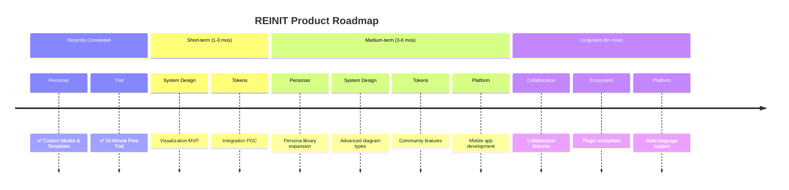

# [Sponsored by Recall AI - API for desktop recording](https://docs.recall.ai/docs/desktop-sdk?utm_source=github&utm_medium=sponsorship&utm_campaign=evinjohnn-natively-ai-assistant)

If you're looking for a hosted desktop recording API, consider checking out [Recall.ai](https://docs.recall.ai/docs/desktop-sdk?utm_source=github&utm_medium=sponsorship&utm_campaign=evinjohnn-natively-ai-assistant), an API that records Zoom, Google Meet, Microsoft Teams, in-person meetings, and more.

<div align="center">
  

# REINIT — Your Career Copilot

**The AI that lives on your machine and knows your entire professional life.**
<br/>
**Local. Private. Always on. Built from a real career restart story.**
<br/>

[](LICENSE)
[](https://github.com/Natively-AI-assistant/natively-cluely-ai-assistant/releases)
[](https://github.com/Natively-AI-assistant/natively-cluely-ai-assistant/releases)

[](https://github.com/Natively-AI-assistant/natively-cluely-ai-assistant)

[](https://x.com/i/communities/2031398735515693507)

> **Every professional spends 30–50% of their work life in high-stakes conversations — interviews, sales calls, client meetings, negotiations. Almost none of that intelligence is captured, searchable, or usable afterward. REINIT changes that.**

<p align="center">
  <a href="https://natively.software">
    
  </a>
</p>

<p align="center">
  <a href="https://github.com/Natively-AI-assistant/natively-cluely-ai-assistant/releases/latest">
    
  </a>
  <a href="https://github.com/Natively-AI-assistant/natively-cluely-ai-assistant/releases/latest">
    
  </a>
</p>

<small>Requires macOS 12+ (Apple Silicon & Intel) or Windows 10/11</small>

<br/>

**<span style="color: #ef4444">👥 9,000+ Users</span>** &nbsp;·&nbsp; **<span style="color: #f97316">🔥 700+ DAU</span>** &nbsp;·&nbsp; **<span style="color: #22c55e">💸 $0 vs $149/mo rivals</span>** &nbsp;·&nbsp; **<span style="color: #3b82f6">⚡ <500ms latency</span>** &nbsp;·&nbsp; **<span style="color: #a855f7">🛡️ 0 data breaches</span>**

</div>

---

## Why REINIT Exists

REINIT was built from a personal story — a career that needed restarting.

Real-time, high-stakes professional conversations are where careers are won or lost: the interview where nerves kill your best answer, the sales call where a question catches you off guard, the negotiation where you don't know your number. These moments happen fast, and then they're gone.

REINIT sits invisibly on your machine and gives you the intelligence layer you need in those moments — not by replacing you, but by making you the best version of yourself. It listens, understands context, surfaces what you know, and suggests what to say — all locally, privately, with no data leaving your machine.

The name is intentional. **REINIT = reinitialize.** A fresh start. A second shot. Whether you're breaking into a new field, recovering from a career setback, or preparing for the biggest interview of your life — REINIT is the tool that helps you walk in ready.

> **Competitors charge $20–$149/month, store your data on their servers, and one already breached 83,000 users.** REINIT costs $0, runs locally, and has never had a data breach. Your keys, your models, your machine.

---

## What Users Are Saying

> "This is a fantastic piece of software and you should definitely keep up the great work! This is exactly what I was looking for. I started out trying the open-source version, and because it worked so well, I decided to go ahead and buy the full premium license."  
> — **Oskar Krzak** (⭐⭐⭐⭐⭐ via Gumroad)

> "REINIT is significantly faster than Cluely when it comes to response time and screen analysis. The latency is practically non-existent."  
> — **Premium User**

> "Just wanted to say thanks! REINIT helped me completely crack the first two rounds of my Software Engineering interviews. The responses were incredibly fast and accurate."  
> — **Private Email Feedback**

> "Used REINIT for my interviews and just landed a massive summer internship. It took all the stress out of the live coding and behavioral rounds!"  
> — **Private Email Feedback**

---

## Why REINIT?

While other tools act as simple API wrappers, REINIT is a complete, native intelligence system designed for high-stakes professional conversations.

- **Native Audio Capture (<500ms):** Built with Rust and Zero-Copy ABI transfers, bypassing generic web-audio limitations for ultra-low latency.
- **Dual-Channel Intelligence:** Distinct pipelines for system audio (what they say) and your microphone (what you dictate) ensuring perfect transcription without room noise.
- **Battle-Tested Stealth Mode:** Completely invisible. Hides from the dock, disables popups, and disguises the process during screen sharing.
- **Rolling Context:** We don't just transcribe — we maintain a memory window of the conversation for smarter, context-aware answers.
- **Local RAG Memory:** We embed your meetings locally using SQLite vector search so you can ask, "What did John say about the API last week?"
- **Custom Personas & Reference Docs:** Switch between tailored AI roles (Tech, Sales, HR) and inject specific PDFs to give the AI your exact context.
- **Rich Dashboard:** A full UI to manage, search, and export your history — not just a floating window.
- **Fully Offline Capable:** Run REINIT 100% offline using local Ollama models. No cloud required.

---

## 3 things you should know before choosing an AI career copilot

1. **Cluely** had a data breach in mid-2025 that exposed 83,000 users' personal info, transcripts, and screenshots — REINIT stores everything locally by default and has never had a breach.
2. **Final Round AI** costs $149/month and its taskbar icon is visible to proctoring software — REINIT is free, open-source, and has a battle-tested undetectable stealth mode.
3. **LockedIn AI** charges $55–70/month and locks you into their cloud LLM with no local option — REINIT lets you use any model (GPT, Claude, Gemini, Llama) or go fully offline with Ollama.

---

<div align="center">

### ⭐ Star this repo — it matters

Every star pushes REINIT higher in GitHub search, helping developers and job seekers find a free, private alternative instead of paying $149/month for tools that store their data on someone else's server.

[](https://github.com/Natively-AI-assistant/natively-cluely-ai-assistant)

</div>

---

## Demo


This demo shows **a complete live meeting scenario**:

- Real-time transcription as the meeting happens
- Rolling context awareness across multiple speakers
- Screenshot analysis of shared slides
- Instant generation of what to say next
- Follow-up questions and concise responses
- All happening live, without recording or post-processing

---

## Full Comparison: REINIT vs Cluely vs Final Round AI vs LockedIn AI vs Interview Coder

| Feature                   | REINIT                     | Cluely               | Pluely     | LockedIn AI      | Final Round AI         |
| :------------------------ | :------------------------- | :------------------- | :--------- | :--------------- | :--------------------- |
| **Price**                 | ✅ Free (BYOK)             | ⚠️ $20/mo            | ✅ Free    | ❌ $55–70/mo     | ❌ $149/mo             |
| **Open source**           | ✅ AGPL-3.0                | ❌                   | ✅         | ❌               | ❌                     |
| **Local data / private**  | ✅ Yes                     | ❌ Cloud servers     | ✅ Yes     | ❌ Cloud servers | ❌ Cloud servers       |
| **Any LLM (BYOK)**        | ✅ Yes                     | ❌ Vendor-locked     | ⚠️ Limited | ❌ Vendor-locked | ❌ Vendor-locked       |
| **Local AI (Ollama)**     | ✅ Yes                     | ❌                   | ❌         | ❌               | ❌                     |
| **Real-time <500ms**      | ✅ Yes                     | ⚠️ 5–90s lag         | ✅ Yes     | ✅ ~116ms        | ⚠️ Slowest             |
| **Dual audio channels**   | ✅ System + Mic            | ❌ Single stream     | ❌         | ❌               | ❌                     |
| **Local RAG memory**      | ✅ SQLite + sqlite-vec     | ❌                   | ❌         | ❌               | ❌                     |
| **Meeting history**       | ✅ Full dashboard          | ⚠️ Limited           | ❌         | ❌               | ⚠️ Limited             |
| **Screenshot OCR**        | ✅ Yes                     | ⚠️ Limited           | ❌         | ✅ Yes           | ⚠️ Limited             |
| **Stealth mode**          | ✅ Undetectable            | ❌                   | ❌         | ❌               | ❌ Visible to proctors |
| **Process Disguise**      | ✅ Terminal, Settings, etc | ❌                   | ❌         | ❌               | ❌                     |
| **Resume & context**      | ✅ Pro                     | ❌                   | ❌         | ✅ Yes           | ✅ Yes                 |
| **Custom Personas/Modes** | ✅ Pro                     | ✅ Yes               | ❌         | ❌               | ⚠️ Limited             |
| **Phone Link Companion**  | ✅ Yes                     | ❌                   | ❌         | ❌               | ❌                     |
| **Auto-Calendar Sync**    | ✅ Yes                     | ❌                   | ❌         | ❌               | ❌                     |
| **Smart Task Sync**       | ✅ Yes                     | ❌                   | ❌         | ❌               | ❌                     |
| **Speaker Diarization**   | ✅ Yes                     | ❌                   | ❌         | ❌               | ❌                     |
| **Codex CLI Integration** | ✅ Yes                     | ❌                   | ❌         | ❌               | ❌                     |
| **Offline SLM Mode**      | ✅ Yes                     | ❌                   | ❌         | ❌               | ❌                     |
| **Data breach history**   | ✅ None                    | ❌ 83k users exposed | ✅ None    | ✅ None          | ✅ None                |

> **Legend:** ✅ Full support · ⚠️ Partial or limited · ❌ Not available

---

## Why REINIT wins

### vs Cluely — breached 83,000 users

Cluely's mid-2025 data breach exposed personal information, full interview transcripts, and screenshots of 83,000 users. Every word spoken during an interview was stored on their servers — and then leaked. They charge $20/month for this privilege.

By default, REINIT stores everything on your local machine, with only limited anonymous telemetry (basic GA4 install tracking, zero personal data). Your transcripts, API keys, and screenshots never leave your machine when using your own keys. The entire codebase is open-source (AGPL-3.0) and auditable. Zero breaches — that is the only acceptable standard for a tool that listens to your most important conversations.

### vs LockedIn AI — $70/month for cloud lock-in

LockedIn AI is the most expensive tool in the category at $55–70/month. It locks you into a single cloud LLM with no option for local inference. Every transcript and response passes through their servers.

REINIT supports every major model (Gemini, GPT, Claude, Groq) via bring-your-own-key, and offers 100% offline mode through Ollama. You pay only for the API tokens you actually use — or pay nothing at all by running Llama 3 locally.

### vs Final Round AI — $149/month and visible to proctors

Final Round AI is the most expensive option at $149/month, with the slowest live latency in the category. Critically, its taskbar icon is visible to proctoring software, making it detectable during monitored sessions.

REINIT delivers <500ms end-to-end latency using Rust-based native audio capture with Zero-Copy ABI Transfers. Its undetectable stealth mode hides from the dock, disguises process names, and syncs state across all windows.

### vs Pluely — lightweight but limited

Pluely is a solid lightweight alternative (~10MB, Tauri-based) and has Linux support, which REINIT does not yet offer. Credit where it is due.

But Pluely is a basic overlay. It has no local RAG, no meeting history, no dual audio channels, and no dashboard. REINIT is a complete intelligence system: it remembers your past meetings via local vector search, separates system audio from your microphone, and gives you a full management dashboard with export to Markdown, JSON, and Text.

### vs Interview Coder — More Powerful, Completely Free

|                                    |    REINIT      | Interview Coder |
| :--------------------------------- | :------------: | :-------------: |
| **Price**                          | ✅ Free (BYOK) |     ❌ Paid     |
| **Open source**                    |       ✅       |       ❌        |
| **Works on LeetCode / HackerRank** |       ✅       |       ✅        |
| **Screenshot + OCR analysis**      |       ✅       |       ✅        |
| **Real-time overlay**              |       ✅       |       ✅        |
| **Local AI / offline mode**        |   ✅ Ollama    |       ❌        |
| **Behavioral interview support**   |       ✅       |       ❌        |
| **System design support**          |       ✅       |       ❌        |
| **Meeting history & RAG**          |       ✅       |       ❌        |
| **Any LLM (BYOK)**                 |       ✅       |    ❌ Locked    |
| **Data stored locally**            |       ✅       |    ❌ Cloud     |

### vs Parakeet AI — Memory and History vs Stateless Overlay

Parakeet AI offers basic live meeting assistance but has no persistent memory, no meeting history, and no local vector search. REINIT remembers your past meetings via local RAG, lets you ask questions across all your history, and gives you a full dashboard to manage, export, and search everything.

---

### Where we're not there yet

- **No Linux support** — actively looking for maintainers
- **API key setup overhead** — you need to bring your own API keys (or install Ollama), which adds initial setup friction compared to all-in-one cloud tools
- **No built-in mock interview mode** — REINIT focuses on live, real-time assistance

---

## Real-Time AI Assistant for Professional Conversations

REINIT works across any high-stakes professional scenario. It captures your screen, analyzes the context, and gives you real-time guidance — all through an invisible overlay that doesn't interfere with your workflow.

**Works across:**

- Job interviews (technical, behavioral, system design)
- Sales and client calls
- Performance reviews
- Coding assessments (LeetCode, HackerRank, CoderPad, Codility, HackerEarth, Karat)
- Any browser-based or desktop application

**How it works:**

1. REINIT listens to the conversation in real-time through your system audio
2. In Manual mode: transcript flows into your input box — review, edit, send when ready
3. In Auto mode: AI fires a suggested response automatically as questions are asked
4. Screenshot a problem, slide, or screen with a single shortcut for instant analysis

> ⚠️ **Note:** REINIT is not designed to bypass dedicated proctoring software like **Pearson VUE**, **ProctorU**, or **Respondus Lockdown Browser** — these run at the OS level and are a different category entirely.

---

<div align="center">

[](https://evinjohn.vercel.app/)
[](https://www.linkedin.com/in/evinjohn/)
[](https://x.com/evinjohnn)
[](mailto:evinjohnn@gmail.com?subject=REINIT%20-%20Hiring%20Inquiry)
[](https://www.buymeacoffee.com/evinjohn)

</div>

---

## REINIT API (Hosted Tier)

**Stop managing four separate services. One key. Zero configuration.**

Are you managing separate accounts for your AI reasoning, live transcription, fast inference, and web search? Juggling multiple API keys, rate limits, and invoices across completely different categories of tools is unnecessary overhead. REINIT API replaces all of those categories with **one flat subscription**.

Under the hood, REINIT API connects you to the best models for the optimal experience:

- **Backend AI Models**: Claude, OpenAI, Gemini, and Groq.
- **Premium STT Models**: Google Chirp 2/3, ElevenLabs Scribe v2, and Deepgram Nova-3.

### 4 Categories → 1 Key

**Your current unbundled stack:**

- **AI Intelligence (GPT/Claude/Gemini):** per-token billing and usage anxiety
- **Lightning-Fast Inference (Groq/Llama):** strict rate limits to monitor
- **Real-Time Transcription (Deepgram/Google STT):** separate key + quota
- **Web Search & Research (Tavily/Perplexity):** yet another subscription

**Replaced by REINIT API:**

- **AI chat, transcription & web search** — all included
- **One flat subscription.** Zero surprise bills. Starts at $8/mo.
- **Single key.** Zero rotation. Zero configuration.

### API Plan Comparison

| Feature                               | Standard ($8/mo) | Pro ($15/mo) | Max ($25/mo) | Ultra ($35/mo) |
| :------------------------------------ | :--------------- | :----------- | :----------- | :------------- |
| **All-in-One Cloud AI Access**        | ✅ Yes           | ✅ Yes       | ✅ Yes       | ✅ Yes         |
| **Real-Time Transcription**           | ✅ Yes           | ✅ Yes       | ✅ Yes       | ✅ Yes         |
| **Included REINIT Pro Desktop App**   | ❌ No            | ✅ Yes       | ✅ Yes       | ✅ Yes         |
| **Premium Support**                   | ❌ No            | ✅ Yes       | ✅ Yes       | ✅ Yes         |
| **Higher Monthly Quotas**             | ❌ No            | ✅ Yes       | ✅ Yes       | ✅ Yes         |

<p align="center">
  <a href="https://checkout.dodopayments.com/buy/pdt_0NbFixGmD8CSeawb5qvVl">
    
  </a>
  <a href="https://checkout.dodopayments.com/buy/pdt_0NcM6Aw0IWdspbsgUeCLA">
    
  </a>
  <a href="https://checkout.dodopayments.com/buy/pdt_0NcM7JElX4Af6LNVFS1Yf">
    
  </a>
  <a href="https://checkout.dodopayments.com/buy/pdt_0NcM7rC2kAb69TFKsZnUU">
    
  </a>
</p>

---

## REINIT Pro

While REINIT is **free and open-source forever**, we also offer a **Pro Edition** (available as **Lifetime or Yearly** subscriptions) designed specifically for power users and professionals. Purchasing a Pro license gives you an edge in the most important moments of your career, all while directly supporting the continued development of the open-source core.

### 🪙 Unlock REINIT Pro with $NAT Token

We've launched the official **$NAT token** on Printr! Holders who maintain a specific balance of `$NAT` tokens in their connected wallet automatically unlock access to all **REINIT Pro** features.

👉 **[Trade $NAT on Printr](https://app.printr.money/trade/0xba1e50273ec14ca52b3fa64a5054c39470c2835392c6ecd06876f5bccd597d7b)**

### Free vs Pro Feature Comparison

| Feature                                             | REINIT Free   | REINIT Pro   |
| :-------------------------------------------------- | :-----------: | :----------: |
| **Bring Your Own Key (BYOK) Models**                |      ✅       |      ✅      |
| **Local AI Support (Ollama)**                       |      ✅       |      ✅      |
| **Real-Time Speech-to-Text (<500ms)**               |      ✅       |      ✅      |
| **Live Contextual Assistant**                       |      ✅       |      ✅      |
| **Screenshot & Slide OCR Analysis**                 |      ✅       |      ✅      |
| **Undetectable & Stealth Modes**                    |      ✅       |      ✅      |
| **Meeting Dashboard & Offline RAG History**         |      ✅       |      ✅      |
| **Job Description (JD) & Resume Context Awareness** |      ❌       |      ✅      |
| **Automated Company Research & Dossiers**           |      ❌       |      ✅      |
| **Live Salary & Offer Negotiation Copilot**         |      ❌       |      ✅      |
| **Custom Persona Modes (Sales, Tech, etc.)**        |      ❌       |      ✅      |
| **Custom Real-Time Context & Reference Files**      |      ❌       |      ✅      |
| **Phone Link Companion App**                        |      ❌       |      ✅      |
| **Auto-Calendar & Task Sync**                       |      ❌       |      ✅      |
| **Speaker Diarization**                             |      ❌       |      ✅      |
| **Priority Feature Access & Support**               |      ❌       |      ✅      |

<p align="center">
  <a href="https://checkout.dodopayments.com/buy/pdt_0NbHo6EnXlNPqNcZ14OTi">
    
  </a>
  <a href="https://checkout.dodopayments.com/buy/pdt_0NcM4QBwy0CDcPV9CXaNP">
    
  </a>
</p>

---

### What's New in v2.6.0

Version 2.6.0 brings massive workflow and integration capabilities:

- **Phone Link Integration**: Connect your iOS or Android device as a wireless remote microphone or companion screen.
- **TinyPrompts™ Engine**: Highly optimized system prompts for local SLMs (Ollama, Qwen 2.5:4B, Llama 3.2), enabling premium intelligence on consumer-grade hardware.
- **Codex CLI Integration**: Native support for sandboxed code execution and local terminal tasks via `gpt-5.3-codex`.
- **Auto-Calendar Sync**: Securely connects to Google Calendar and Outlook to automatically prepare for upcoming meetings.
- **Smart Task Sync**: Action items auto-extracted and exported to Jira, Linear, or Asana.
- **Speaker Identification**: Advanced real-time speaker diarization automatically tags individual speakers by name.
- **Expanded Offline Mode**: 100% offline transcription and intelligent note generation using on-device SLMs.
- **Advanced Stealth Features**: Hardened stealth mode with Activity Monitor evasion, process name disguising, and strict timeout management.
- **Scroll & Layout Enhancements**: Scroll keybinds for seamless mouse-free navigation.

---

### What's New in v2.5.0

- **Custom Persona Modes**: Technical Interview, Sales, Recruiting, Team Meet, Lecture, and more.
- **Dynamic Note Templates**: AI generates structured meeting notes based on the active persona mode.
- **Reference Files & Custom Context**: Upload PDFs, DOCX files, or custom instructions into the real-time prompt.
- **10-Minute Free Trial**: Try the hosted API with built-in anti-abuse protections.
- **Reliable Screenshot Capture**: Hardened multi-screenshot capture with single-trigger `Cmd+Shift+Enter` analysis.
- **STT Connection Pools & Resilience**: Round-robin connection pools for Deepgram and ElevenLabs with exponential backoff.

---

## Table of Contents

- [Why REINIT Exists](#why-reinit-exists)
- [What Users Are Saying](#what-users-are-saying)
- [Why REINIT?](#why-reinit)
- [3 things to know](#3-things-you-should-know-before-choosing-an-ai-career-copilot)
- [Demo](#demo)
- [Full comparison](#full-comparison-reinit-vs-cluely-vs-final-round-ai-vs-lockedin-ai-vs-interview-coder)
- [Why REINIT wins](#why-reinit-wins)
- [REINIT Pro](#reinit-pro)
- [What's New in v2.6.0](#whats-new-in-v260)
- [Privacy & Security](#privacy--security-core-design-principle)
- [Installation](#installation-developers--contributors)
- [AI Providers](#ai-providers)
- [Key Features](#key-features)
- [Meeting Intelligence Dashboard](#meeting-intelligence-dashboard)
- [Roadmap](#roadmap)
- [Use Cases](#use-cases)
- [Technical Details](#technical-details)
- [Known Limitations](#known-limitations)
- [Responsible Use](#responsible-use)
- [Contributing](#contributing)
- [License](#license)
- [FAQ](#faq)

---

## What Is REINIT?

**REINIT** is a **desktop AI copilot for your professional life**:

- Job interviews
- Sales and client calls
- Meetings and presentations
- Negotiations
- Technical assessments
- Any high-stakes professional conversation

It provides:

- Live answers and suggestions
- Rolling conversational context
- Screenshot and document understanding
- Real-time speech-to-text
- Long-term memory of your past meetings via local RAG

All while remaining **invisible, fast, and privacy-first**.

---

## Privacy & Security (Core Design Principle)

- 100% open source (AGPL-3.0)
- Bring Your Own Keys (BYOK)
- Local AI option (Ollama)
- All data stored locally
- Limited anonymous telemetry (basic GA4 counts)
- No user data tracking
- No hidden uploads

You explicitly control:

- What runs locally
- What uses cloud AI
- Which providers are enabled

---

## Installation (Developers & Contributors)

> [!NOTE]
> **macOS Users (Both Apple Silicon & Intel Macs supported):**
>
> 1.  **"Unidentified Developer"**: If you see this, Right-click the app > Select **Open** > Click **Open**.
> 2.  **"App is Damaged"**: If you see this, run the command in Terminal based on your download:
>
>     **For .zip downloads:**
>
>     ```bash
>     xattr -cr /Applications/Natively.app
>     ```
>
>     **For .dmg downloads:**
>     1. Open Terminal and run:
>        ```bash
>        xattr -cr ~/Downloads/Natively-2.0.2-arm64.dmg # Or your specific filename
>        ```
>     2. Install the natively.dmg
>     3. Open Terminal and run: `xattr -cr /Applications/Natively.app`

### Prerequisites

- Node.js (v20+ recommended)
- Git
- Rust (required for native audio capture)

### AI Credentials & Speech Providers

**REINIT is 100% free to use with your own keys.**  
Connect **any** speech provider and **any** LLM. No subscriptions, no markups, no hidden fees. All keys are stored locally.

### Speech Providers

- **Soniox** (API Key) - _Ultra-fast, highly accurate streaming STT_
- **Google Cloud Speech-to-Text** (Service Account)
- **Groq** (API Key)
- **OpenAI Whisper** (API Key)
- **Deepgram** (API Key)
- **ElevenLabs** (API Key)
- **Azure Speech Services** (API Key + Region)
- **IBM Watson** (API Key + Region)

### AI Engine Support (Bring Your Own Key)

| Provider                     | Best For                                                    |
| :--------------------------- | :---------------------------------------------------------- |
| **Gemini 3.1 Series**        | Recommended: Massive context window (2M tokens) & low cost. |
| **OpenAI (GPT-5.4 & o3)**    | High reasoning capabilities.                                |
| **Anthropic (Claude 4.6)**   | Coding & complex nuanced tasks.                             |
| **Groq (Llama 3.3/Scout 4)** | Insane speed (near-instant answers) & screenshot analysis.  |
| **Ollama / LocalAI**         | 100% Offline & Private (No API keys needed).                |
| **OpenAI-Compatible**        | Connect to _any_ custom endpoint (vLLM, LM Studio, etc.)    |

> **Note:** You only need ONE speech provider to get started. We recommend **Google STT**, **Groq**, or **Deepgram** for the fastest real-time performance.

---

#### To Use Google Speech-to-Text (Optional)

Your credentials:

- Never leave your machine
- Are not logged, proxied, or stored remotely
- Are used only locally by the app

What You Need:

- Google Cloud account
- Billing enabled
- Speech-to-Text API enabled
- Service Account JSON key

Setup Summary:

1. Create or select a Google Cloud project
2. Enable Speech-to-Text API
3. Create a Service Account
4. Assign role: `roles/speech.client`
5. Generate and download a JSON key
6. Point REINIT to the JSON file in settings

---

## Development Setup

### Clone the Repository

```bash
git clone https://github.com/Natively-AI-assistant/natively-cluely-ai-assistant.git
cd natively-cluely-ai-assistant
```

### Install Dependencies

```bash
npm install
```

### Build Native Audio Module (Rust)

```bash
npm run build:native
```

### Environment Variables

Create a `.env` file:

```env
# Cloud AI
GEMINI_API_KEY=your_key
GROQ_API_KEY=your_key
OPENAI_API_KEY=your_key
CLAUDE_API_KEY=your_key
GOOGLE_APPLICATION_CREDENTIALS=/absolute/path/to/service-account.json

# Speech Providers (Optional - only one needed)
DEEPGRAM_API_KEY=your_key
ELEVENLABS_API_KEY=your_key
AZURE_SPEECH_KEY=your_key
AZURE_SPEECH_REGION=eastus
IBM_WATSON_API_KEY=your_key
IBM_WATSON_REGION=us-south

# Local AI (Ollama)
USE_OLLAMA=true
OLLAMA_MODEL=llama3.2
OLLAMA_URL=http://localhost:11434

# Default Model Configuration
DEFAULT_MODEL=gemini-3.1-flash-lite-preview
```

### Run (Development)

```bash
npm start
```

### Build (Production)

```bash
npm run dist
```

This runs: Vite build → TypeScript compile → native module build → electron-builder

---

### AI Providers

- **Custom (BYO Endpoint):** Paste any cURL command to use OpenRouter, DeepSeek, or private endpoints.
- **Ollama (Local):** Zero-setup detection of local models (Llama 3, Mistral, Gemma).
- **Dynamic Model Selection:** Preferred models (OpenAI, Anthropic, Google) now automatically appear across the app.
- **Google Gemini:** First-class support for the Gemini 3.1 series.
- **OpenAI:** GPT-5.4 and o3 series support with optimized system prompts.
- **Anthropic:** Claude 4.6 series support with corrected max_tokens.
- **Groq:** Ultra-fast text inference with Llama 3.3, and screenshot analysis using Llama 4 Scout.

---

## Key Features

### Invisible Desktop Assistant

- Always-on-top translucent overlay
- Instantly hide/show with shortcuts
- Works across all applications

### Real-time Career Copilot

- Real-time speech-to-text (**<500ms latency**)
- **Fast Response Mode**: Ultra-fast text responses using Groq Llama 3.3.
- **Multilingual Support**: Choose from various response languages and speech recognition accents.
- **Human Persona System**: Refined system prompts ensure responses are concise, conversational, and natural — no robotic preambles.
- Context-aware Memory (RAG) for past meetings
- Instant answers as questions are asked
- **Smart Recap & Summaries**: Instant meeting minutes and executive summaries.
- **TinyPrompts™ Engine**: Specialized prompt architecture for local SLMs (4B-8B params).
- **Dynamic Note Templates**: AI generates structured notes based on your active persona mode.

### Screen & Slide Analysis (OCR)

- Works on LeetCode, HackerRank, CoderPad, Codility, HackerEarth, and any browser-based environment
- Capture with one shortcut — get a full analysis instantly
- Invisible overlay never appears on screen share
- Multiple screenshot support for multi-part problems

### Premium Profile Intelligence

- **Custom Persona Modes**: Switch between Technical Interview, Sales, Recruiting, or create your own.
- **Reference Files & Custom Context**: Upload PDFs, DOCX files, or custom instructions.
- **Job Description & Resume Context**: Tailored, context-aware answers based on your background and the role.
- **Company Research**: Instant intelligence on the company you're meeting with.
- **Negotiation Assistance**: Real-time guidance during offer and salary negotiations.

### Contextual Actions

- What should I say next?
- Shorten response
- Recap conversation
- Suggest follow-up questions
- Manual or voice-triggered prompts

### Seamless Integrations & Sync

- **Phone Link:** Use your iOS/Android device as a wireless remote microphone or companion screen.
- **Calendar Prep:** Auto-syncs with Google Calendar and Outlook to prepare context before meetings.
- **Smart Task Export:** Send extracted action items directly to Jira, Linear, or Asana.
- **Speaker Diarization:** Real-time speaker identification tags individual speakers by name.
- **Codex CLI:** Execute terminal tasks, manage workspace files, and run sandboxed code.

### Dual-Channel Audio Intelligence

- **System Audio (The Meeting):** Captures high-fidelity audio directly from your OS. Hears what others are saying without room noise interference.
- **Sample Rate Auto-Detection**: Dynamically detects and syncs true hardware sample rates.
- **Two-Stage Silence Processing**: Combines adaptive RMS thresholds with WebRTC Machine Learning VAD.
- **Microphone Input (Your Voice):** Dedicated channel for voice commands and dictation.

### Local RAG & Long-Term Memory

- **Full Offline RAG:** All vector embeddings and retrieval happen locally (SQLite + `sqlite-vec`).
- **Semantic Search:** Smart Scope detects if you're asking about the current meeting or a past one.
- **Sliding-Window RAG**: 50-token semantic overlap to prevent context loss across chunk boundaries.
- **Global Knowledge:** Ask questions across _all_ your past meetings.
- **Automatic Indexing:** Meetings are automatically chunked, embedded, and indexed in the background.

### Advanced Privacy & Stealth

- **Undetectable Mode:** Instantly hide from dock/taskbar.
- **Process Disguise:** Change the app to look like Terminal, System Settings, Activity Monitor, or other system utilities.
- **Security Hardening**: API keys are scrubbed from memory on app quit.
- **API Rate Limiting**: Token-bucket algorithm to prevent 429 errors on free-tier providers.
- **Local-Only Processing:** All data stays on your machine.

---

## Meeting Intelligence Dashboard

REINIT includes a powerful, local-first meeting management system to review, search, and manage your entire conversation history.


- **Meeting Archives:** Access full transcripts of every past meeting, searchable by keywords or dates.
- **Smart Export:** One-click export to **Markdown, JSON, or Text**.
- **Usage Statistics:** Track your token usage and API costs in real-time.
- **Audio Separation:** Distinct controls for System Audio vs. Microphone.
- **Session Management:** Rename, organize, or delete past sessions.

---

## Roadmap



<div align="center">
  <em>For detailed feature descriptions, see our full <a href="ROADMAP.md">ROADMAP.md</a>.</em>
</div>

---

## Use Cases

### Career & Interviews

- **Interview Support:** Context-aware prompts to help you navigate technical and behavioral questions.
- **Salary Negotiation:** Real-time strategy and talking points during offer discussions.
- **Career Transitions:** Research, preparation, and real-time support for moving into a new field.

### Professional Meetings

- **Sales & Client Calls:** Real-time clarification of specs or previous discussion points.
- **Meeting Summaries:** Automatically extract action items and core decisions.
- **Performance Reviews:** Preparation and real-time recall of past accomplishments.

### Development & Technical Work

- **Code Insight:** Explain unfamiliar blocks of code or logic on your screen.
- **Debugging:** Context-aware assistance for resolving logs or terminal errors.
- **Architecture:** Guidance on system design and integration patterns.

### Academic & Learning

- **Live Assistance:** Explanations for complex lecture topics in real-time.
- **Problem Solving:** Immediate help with coding or mathematical problems.

---

## Architecture Overview

REINIT processes audio, screen context, and user input locally, maintains a rolling context window, and sends only the required prompt data to the selected AI provider (local or cloud).

No raw audio, screenshots, or transcripts are stored or transmitted unless explicitly enabled by the user.

---

## Technical Details

### Tech Stack

- **React, Vite, TypeScript, TailwindCSS**
- **Electron**
- **Rust** (native audio with **Zero-Copy ABI Transfers** via `napi::Buffer`)
- **SQLite** (local storage with `sqlite-vec`)

### Supported Models

- **Gemini 3.1 Series**
- **OpenAI** (GPT-5.4, o3 series)
- **Claude** (4.6 series)
- **Ollama** (Llama, Mistral, CodeLlama)
- **Groq** (Llama 3.3 for text, Llama 4 Scout for OCR)

### System Requirements

- **Minimum:** 4GB RAM
- **Recommended:** 8GB+ RAM
- **Optimal:** 16GB+ RAM for local AI

---

## Responsible Use

REINIT is intended for:

- Learning and skill development
- Productivity and meeting efficiency
- Accessibility
- Professional career advancement

Users are responsible for complying with:

- Workplace policies
- Academic rules
- Local laws and regulations

This project does not encourage misuse or deception.

---

## Known Limitations

- Linux support is limited and actively looking for maintainers
- Initial setup requires bringing your own API keys or installing Ollama
- No built-in mock interview mode (focus is on live, real-time assistance)

---

## Contributing

Contributions are welcome! Please see our [CONTRIBUTING.md](CONTRIBUTING.md) for full guidelines.

- Bug fixes
- Feature improvements
- Documentation
- UI/UX enhancements
- New AI integrations

### Maintainers

| Maintainer                                 | Role          | Support                                                                                                                                                                     |
| ------------------------------------------ | ------------- | --------------------------------------------------------------------------------------------------------------------------------------------------------------------------- |
| [@evinjohnn](https://github.com/evinjohnn) | macOS Build   | [](https://www.buymeacoffee.com/evinjohnn) |
| [@razllivan](https://github.com/razllivan) | Windows Build | [](https://app.lava.top/razllivan)         |

---

## License

Licensed under the GNU Affero General Public License v3.0 (AGPL-3.0).

If you run or modify this software over a network, you must provide the full source code under the same license.

This repository contains the open-source core of the project. Some features available in official releases are part of the commercial Premium Edition and are not included in this repository.

> **Note:** This project is available for sponsorships, ads, or partnerships — perfect for companies in the AI, productivity, or developer tools space.

---

**Star this repo if REINIT helps you succeed in meetings, interviews, or the most important conversations of your career.**

---

## FAQ

#### Is REINIT really free?

Yes. REINIT is an open-source project. You only pay for what you use by bringing your own API keys (Gemini, OpenAI, Anthropic, etc.), or use it **100% free** by connecting to a local Ollama instance.

#### Does REINIT work with Zoom, Teams, and Google Meet?

Yes. REINIT uses a Rust-based system audio capture that works universally across any desktop application, including Zoom, Microsoft Teams, Google Meet, Slack, and Discord.

#### Is my data safe?

REINIT is built on **Privacy-by-Design**. By default, all transcripts, vector embeddings, and keys are stored locally on your machine. We collect only limited anonymous telemetry (no personal user data).

#### Can I use it for professional meetings and interviews?

Yes. REINIT is designed for any high-stakes professional conversation. Users are responsible for complying with their company policies and applicable guidelines.

#### How do I use local models?

Simply install **Ollama**, run a model (e.g., `ollama run llama3`), and REINIT will automatically detect it. Enable "Ollama" in the AI Providers settings to switch to offline mode.

#### How does REINIT compare to Cluely?

Cluely is a $20/month cloud-based tool that stores all data on their servers. In mid-2025, Cluely suffered a data breach that exposed personal information, transcripts, and screenshots of 83,000 users. REINIT is free, open-source, and stores everything locally. It supports any LLM, offers local AI via Ollama, and has never had a data breach because there is no server to breach.

#### Is stealth mode actually undetectable?

Yes. REINIT hides from the dock, disguises process names as harmless system utilities (Terminal, Activity Monitor, System Settings), and syncs state across all windows. Hardened across five major releases and tested against screen share detection in Zoom, Teams, and Google Meet.

#### Is REINIT a free alternative to Interview Coder?

Yes. REINIT does everything Interview Coder does — screenshot OCR, real-time assistance, invisible overlay — and adds behavioral interview support, system design help, local RAG memory, and any-LLM BYOK. All for free.

---

## Alternatives REINIT Replaces

| Tool                | What REINIT replaces                                                                |
| :------------------ | :---------------------------------------------------------------------------------- |
| **Cluely**          | Real-time AI meeting copilot — without the $20/mo fee or data breach risk           |
| **Final Round AI**  | Live AI interview copilot — without the $149/mo fee or proctor-visible taskbar icon |
| **LockedIn AI**     | Real-time interview assistant — without cloud lock-in or $70/mo                     |
| **Interview Coder** | AI coding interview helper — with full meeting context, not just coding rounds      |
| **Parakeet AI**     | Live meeting assistant — with local RAG memory and full history dashboard           |
| **Metaview**        | Automated meeting notes — open-source and locally stored                            |
| **Otter.ai**        | Transcription and meeting summaries — without cloud storage                         |
| **Fireflies.ai**    | Meeting recorder and AI notetaker — fully local storage                             |
| **Teal**            | Job search and interview assistant — fully local and free                           |

---

`career-copilot` · `ai-assistant` · `meeting-notes` · `interview-helper` · `cluely-alternative` · `cluely` · `reinit` · `parakeet-ai` · `interview-coder` · `final-round-ai` · `lockedin-ai-alternative` · `metaview-alternative` · `otter-ai-alternative` · `fireflies-alternative` · `local-ai` · `ollama` · `electron` · `privacy-first` · `open-source` · `real-time-transcription` · `interview-copilot` · `ai-meeting-assistant`

---

## Star History

<a href="https://star-history.com/#evinjohnn/natively-cluely-ai-assistant&Date">
 <picture>
   <source media="(prefers-color-scheme: dark)" srcset="https://api.star-history.com/svg?repos=evinjohnn/natively-cluely-ai-assistant&type=Date&theme=dark" />
   <source media="(prefers-color-scheme: light)" srcset="https://api.star-history.com/svg?repos=evinjohnn/natively-cluely-ai-assistant&type=Date" />
   
 </picture>
</a>

<sub>
career-copilot · reinit · ai-interview-assistant · real-time-interview-ai · cluely-alternative · cluely-clone · interview-coder-alternative · final-round-ai-alternative · lockedin-ai-alternative · stealth-mode · local-ai · ollama · byok · rag · electron · rust · privacy-first · meeting-assistant · interview-helper · open-source-interview-ai
</sub>
